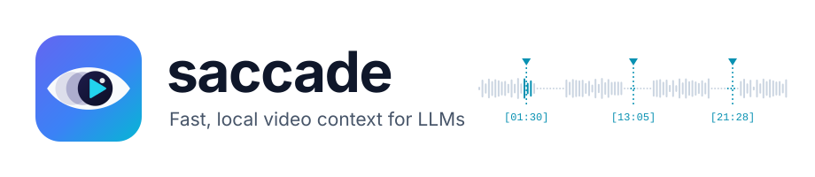

<p align="center">
  <picture>
    <source media="(prefers-color-scheme: dark)" srcset="assets/banner-dark.svg">
    
  </picture>
</p>

<p align="center">
  <b>Turn any video into timestamped, searchable, LLM-ready evidence, locally and in seconds.</b><br>
  Speech, representative frames and source timestamps for any LLM, on your CPU or GPU.
</p>

<p align="center">
  <a href="https://pypi.org/project/saccade-video/"></a>
  <a href="https://pypi.org/project/saccade-video/"></a>
  <a href="https://github.com/gabe-santana/saccade/actions/workflows/ci.yml"></a>
  <a href="LICENSE"></a>
  <a href="https://mypy-lang.org/"></a>
  <a href="https://github.com/astral-sh/ruff"></a>
</p>

<p align="center">
  <a href="#quick-start">Quick start</a> ·
  <a href="docs/README.md">Documentation</a> ·
  <a href="examples/">Examples</a> ·
  <a href="#how-it-works">How it works</a> ·
  <a href="CONTRIBUTING.md">Contributing</a>
</p>

<p align="center">
  <br>
  <sub>Illustrative run; the indexing time is the measured GPU result from <a href="#fast">Fast</a>.</sub>
</p>

```python
import saccade

video = saccade.Video("interview.mp4", llm=saccade.azure())
print(video.ask("How did the candidate handle the system design question?"))
```

That's the whole program. Saccade transcribes what was **said** and picks frames of what was
**shown**, entirely on your machine. It caches both, then lets your LLM **navigate the
video**: search the transcript, look at exact moments and zoom into details until it can
answer, citing `[mm:ss]` timestamps.

> **Why "saccade"?** A saccade is the quick jump your eyes make between points of interest.
> Your eyes don't take in a scene pixel by pixel, and an LLM shouldn't take in a video
> frame by frame. Saccade jumps straight to the moments that matter.

---

## Why Saccade?

LLMs can't watch an hour of video. Sending one to a multimodal API is slow and expensive,
ties you to one provider, and uploads the whole file. Most videos are mostly silence,
repeated frames and talking heads anyway.

Saccade does the heavy lifting locally and hands the model only the evidence it needs:

|  |  |
|---|---|
| 🎙️ **Multilingual transcription** | Whisper (faster-whisper / CTranslate2) with Silero VAD. Silence never reaches the model, and the language is detected automatically. |
| 🖼️ **Representative frames** | Slide changes, scene cuts and settled screens are chosen from tiny thumbnails, with duplicates removed by perceptual hashing. No vision model needed. |
| 🔎 **Instant search** | SQLite FTS5 with BM25, multilingual normalisation, stemming and CJK bigrams. Searches take **~0.3 ms**. |
| 🧩 **RAG-ready context** | `video.context(question)` returns token-budgeted, timestamped evidence you can paste into *any* prompt or vector store. |
| 🧭 **The LLM explores the video** | With tool calling, the model views exact frames, zooms in at native resolution and reads transcript ranges until it has enough. |
| ⚡ **CPU-first, GPU-fast** | Runs well on a laptop CPU. With `device="cuda"`, a 26-minute 3440×1440 recording is indexed in **9 s**. |
| 💾 **Indexed once, cached** | Content-fingerprinted, resumable and incremental. A second `index()` takes milliseconds, even after you move the file. |
| 🔒 **Private by design** | The video never leaves your machine. Without an LLM, nothing touches the network. With Ollama, nothing does at all. |
| 🪶 **Lightweight** | Four dependencies: faster-whisper, PyAV (bundles FFmpeg), onnxruntime, numpy. No PyTorch, Docker or database server. |

## Quick start

```bash
pip install saccade-video                # imported as `saccade`
pip install "saccade-video[gpu]"         # optional: NVIDIA CUDA 12 libraries from pip, no toolkit needed
```

Python 3.11+ on Windows, macOS or Linux. The Whisper model (~480 MB for `small`) downloads
once on first use; after that Saccade runs offline.

### 1. Ask a question

```python
import saccade

# Reads AZURE_AI_ENDPOINT, AZURE_AI_API_KEY and AZURE_AI_DEPLOYMENT from the environment.
video = saccade.Video("meeting.mp4", llm=saccade.azure(reasoning_effort="low"))

answer = video.ask("What did they decide about the release date?", progress=print)

print(answer)               # the answer, citing [mm:ss] timestamps
print(answer.steps)         # how the model explored: searches, frames, zooms
print(answer.total_tokens)  # what it cost (answer.cached_tokens shows the discounted part)
```

### 2. No LLM? Search and build context, 100% offline

```python
from saccade import Video

video = Video("meeting.mp4")
video.index()                                     # transcribe + frames, cached afterwards

for hit in video.search("deployment failed", limit=3):
    print(f"[{hit.start:.0f}s] {hit.text}")

context = video.context("Why did the deployment fail?", max_tokens=4000)
print(context.text)                               # timestamped evidence for any prompt
```

```text
VIDEO: meeting.mp4
DURATION: 1:02:13 · LANGUAGE: en · TRANSCRIPT: complete
QUERY: Why did the deployment fail?

Relevant evidence (verbatim transcript; times refer to the source video):

[12:22.1–12:49.8 | seg_00042–seg_00045]
We are switching authentication to managed identity because the client secret expired...
```

### 3. Or from the terminal

```bash
saccade index meeting.mp4
saccade search meeting.mp4 "authentication"
saccade context meeting.mp4 "Why did the deployment fail?" --max-tokens 4000
saccade ask meeting.mp4 "Summarize the meeting"      # uses the AZURE_AI_* variables
saccade transcribe meeting.mp4 -f srt -o meeting.srt
```

## Bring any LLM

| Provider | Connection |
|---|---|
| Azure AI Foundry / Azure OpenAI | `saccade.azure(endpoint, api_key, deployment)`; any URL the Foundry portal shows works |
| OpenAI | `saccade.openai("gpt-4o")` (uses `OPENAI_API_KEY`) |
| Ollama, fully offline | `saccade.ollama("llama3.1")` |
| Any OpenAI-compatible server (vLLM, LM Studio, OpenRouter...) | `saccade.OpenAICompatible(base_url, model, api_key)` |
| Your own client | Any object with `complete(messages, max_tokens=...)`; see [Extending](docs/extending.md) |

Reasoning models (GPT-5, o-series) are supported. Token usage, including cached and
reasoning tokens, is reported on every answer.

## The LLM navigates the video

A transcript and a few thumbnails can't answer *"what was on the whiteboard?"*. When your
LLM supports tool calling, `ask()` gives it an overview and these tools:

| Tool | What the model gets back |
|---|---|
| `search_transcript(query)` | When something was said |
| `read_transcript(start, end)` | The verbatim transcript of any time range |
| `view_frames(timestamps)` | The exact frames at those moments, decoded on demand from the source |
| `zoom(timestamp, x, y, width, height)` | One region of a frame (a face, a slide, a code snippet) at native resolution |

Exploration is bounded (`max_steps`, `max_views`), images are sized to about 425 tokens
each, and every round only appends to the conversation, so provider prompt caching bills
the repeated prefix at a discount. Every image the model looked at comes back in
`answer.frames` with its exact timestamp, so you can always check its work.
Read more in [Asking questions](docs/asking-questions.md).

## Fast

Measured on a laptop (i7-14650HX, RTX 5050 Laptop GPU), with the model already downloaded:

| Workload | Time |
|---|---|
| 26-min 3440×1440 interview, GPU (`device="cuda"`, `keyframes_only=True`) | **9 s** (first transcript lines after 2.3 s) |
| Same video, CPU only (`small`, int8) | 175 s |
| 2-hour meeting, CPU, transcription | 8 min 54 s (RTF 0.074), 1.1 GB peak memory |
| Re-opening an indexed video | ~20 ms |
| `search()` | 0.3–2.3 ms |

Results stream as they're produced: the first segments are searchable within about 3 seconds,
long before indexing finishes. See [Performance](docs/performance.md) for the full table and
how to reproduce it.

## How it works

```text
                ┌──────────── background thread ────────────┐
 video ─► PyAV ─┤ 16 kHz audio ─► Silero VAD ─► ~30 s packs ├─► Whisper ─► SQLite + FTS5 ─┐
                └───────────────────────────────────────────┘    (speech only)            │
       └──────► ~1 fps thumbnails ─► change/scene detection ─► dHash dedup ─► frames ─────┤
                                                                                          ▼
          search() · context() · frames() · transcript() ◄────── timestamped index ───────┘
                                     │
                                     ▼
                     ask() ─► your LLM ⇄ tools (search, read, view, zoom)
```

- **Silence never reaches Whisper.** Speech regions are packed into ~30 s windows, each
  with a map back to the source timeline. That cuts transcription time on typical
  recordings.
- **Timestamps come from decoded PTS, never from frame numbers × fps.** They are correct for
  variable-frame-rate video, and correct across pack seams.
- **Every pack commits atomically with its resume point.** Interrupt indexing at any time;
  the next call continues where it stopped, and searches see new segments immediately.
- **Every stage is replaceable.** Plug in your own ASR backend, VAD or LLM client.

Details: [Concepts](docs/concepts.md) · [Architecture and limitations](docs/architecture.md)

## More things you can do

```python
for segment in video.transcribe():           # stream segments as they're transcribed
    print(segment.start, segment.text)

job = video.index(background=True)           # index in the background...
video.search("rollback")                     # ...while querying the partial index

video.transcript().to_srt()                  # subtitles: .to_srt(), .to_vtt(), .to_json()
video.chunks()                               # 20–60 s chunks for your own vector store
[f.data_url() for f in video.frames()]       # frames as data URLs for multimodal APIs

saccade.Video("aula.mp4", language="pt", profile="accurate")   # language, model size
answer = await video.aask("...")             # async everything
```

## Documentation

| | |
|---|---|
| [Getting started](docs/getting-started.md) | Install and get a first answer in five minutes |
| [Concepts](docs/concepts.md) | What gets stored and cached, and when a video is reprocessed |
| [Asking questions](docs/asking-questions.md) | `ask()`, LLM connections, exploration, token costs |
| [Search and RAG context](docs/search-and-context.md) | `search()`, `context()`, `chunks()`, your own RAG stack |
| [Transcription](docs/transcription.md) · [Frames](docs/frames.md) | Profiles, languages, streaming, exports, visual strategies |
| [Performance](docs/performance.md) | GPU, CPU tuning, memory, benchmarks |
| [CLI](docs/cli.md) · [API reference](docs/api-reference.md) | Every command, class and parameter |
| [Extending](docs/extending.md) · [Troubleshooting](docs/troubleshooting.md) | Custom backends, common errors |

## Roadmap

Saccade 0.1 covers transcription, frames, search, context and `ask()` with exploration.
Next up:

- 🧠 **Semantic search:** optional multilingual embeddings with hybrid lexical, semantic and temporal ranking
- 🗣️ **Speaker diarization:** who said what
- 🔤 **On-screen text:** OCR for slides and screen recordings, searchable like speech
- 🍎 **More backends:** whisper.cpp (Apple Silicon / Metal), more LLM providers
- 🧹 **Cache management:** `saccade cache list / prune / clear`

Follow along, or pick something up, in the
[issues](https://github.com/gabe-santana/saccade/issues). Look for
[`good first issue`](https://github.com/gabe-santana/saccade/labels/good%20first%20issue).

## Contributing

Contributions are very welcome, from typo fixes to new backends. The test suite runs
in under a minute with no model downloads, because deterministic stand-ins replace Whisper
and VAD.

```bash
git clone https://github.com/gabe-santana/saccade && cd saccade
python -m venv .venv && source .venv/bin/activate     # Windows: .venv\Scripts\activate
pip install -e ".[dev]"
pytest
```

Read [CONTRIBUTING.md](CONTRIBUTING.md) to get started. AI coding agents should read
[AGENTS.md](AGENTS.md). Please follow our [Code of Conduct](CODE_OF_CONDUCT.md), and
report vulnerabilities privately as described in [SECURITY.md](SECURITY.md).

## License

[MIT](LICENSE) © Gabriel Santana

Saccade builds on [faster-whisper](https://github.com/SYSTRAN/faster-whisper),
[CTranslate2](https://github.com/OpenNMT/CTranslate2), [OpenAI Whisper](https://github.com/openai/whisper),
[Silero VAD](https://github.com/snakers4/silero-vad), [PyAV](https://github.com/PyAV-Org/PyAV)/[FFmpeg](https://ffmpeg.org)
and [SQLite FTS5](https://www.sqlite.org/fts5.html). Thank you to their authors.

<p align="center"><sub>If Saccade saves you from scrubbing through a video, consider giving it a ⭐</sub></p>
